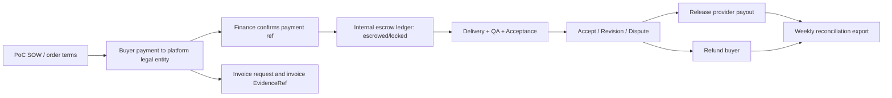

# AlphaAgents 首单成交、法务与样单包

## 文档边界

本文件是销售启用、首单说明、样单解读和合同附件草稿的执行材料，不是产品范围或完成验收的权威来源。所有样例默认是 `sample_only` 或 `sandbox_verified`，除非附带真实付款、客户授权交付包、验收记录或签约证据并明确标为 `validated`。

## 1. 甲方下首单一页纸

| 问题 | 回答 |
| --- | --- |
| 买什么 | 跨境电商竞品监控与内容选题情报包 |
| 适合谁 | 美区 TikTok Shop / Amazon 美妆个护品牌内容负责人；次级为服务同类品牌的 agency |
| 先买哪档 | 默认 Trial Quick Order；只有 Trial 通过或已有 5-10 单 backlog 才进入 Standard/PoC |
| 多久交付 | Trial 48h、Standard 72h、Pro 5 个工作日 |
| 需要提供什么 | 品类/市场、5 个竞品、输出语言、验收人、付款方式 |
| 钱是否安全 | 未付款确认不得执行；QA 未通过不得验收；验收/裁决后才按条件放款、退款或部分放款 |
| 不满意怎么办 | Trial 只看 3 条：5 个竞品、证据可回看、至少 10 个可用选题；不满足则限定修改或争议 |
| 数据边界 | 只读公开资料或客户上传副本，不登录生产账号，不发布内容，不动广告预算或资金 |
| 今天下一步 | 选择 Trial Quick Order，填写 5 个竞品，确认只读边界和付款方式 |

## 2. Buyer acceptance mini terms

Trial 买家只需要判断 3 件事：

| Check | Pass condition | Failed action |
| --- | --- | --- |
| 竞品覆盖 | 5 个约定竞品均覆盖，或无法取得公开来源时有说明 | 限定修改 |
| 证据可回看 | 关键结论有 EvidenceRef，链接可打开或有截图/hash | 限定修改或争议 |
| 可用选题 | 至少 10 个选题可直接进入内容排期 | 限定修改 |

平台内部仍保留 100 分 QA 和资金裁决模型，但不要求首单买家学习评分权重。

## 3. Sandbox package

仓库内可打开的结构化样单在 [AA-SANDBOX-TRIAL-001](../evidence-packages/AA-SANDBOX-TRIAL-001)。它是 `sample_only + sandbox_verified`，只证明工件结构和闭环可校验，不证明真实客户付款。

异常路径样单同时存在：

- [AA-SANDBOX-REVISION-002](../evidence-packages/AA-SANDBOX-REVISION-002)：买方触发一次 bounded revision，修订后验收通过。
- [AA-SANDBOX-DISPUTE-003](../evidence-packages/AA-SANDBOX-DISPUTE-003)：买方发起争议，平台按证据权重做 partial release。

## 4. 完整填好的 Standard 首单样例

样例状态：`sample_only`，用于产品、销售和 QA 演示，不声称真实客户。它是 Standard 级别的目标样例，不是当前仓库里 Trial sandbox 包的实物规格。

### 4.1 RFP

| 字段 | 值 |
| --- | --- |
| rfpId | `rfp_sample_001` |
| buyerOrgName | NorthStar Beauty |
| buyerOwner | Content Growth Lead |
| packageTier | Standard |
| category | US sensitive-skin skincare |
| market | US |
| channels | TikTok Shop, Instagram public posts, Amazon listing, Shopify landing pages |
| language | 中文分析，英文证据原文 |
| competitors | GlowLab, PureSkin, Dermory, CalmRoot, SkinNova, BarrierCo, GentleLab, DermaRoot, SoftPeak, CloudSkin |
| prohibitedSources | 不登录客户后台，不使用付费账号，不采集私域群，不抓取个人敏感信息 |
| deliverableFormat | PDF + XLSX + evidence-index.csv |
| acceptanceWindowHours | 48 |
| requiredSections | 竞品变化、卖点拆解、内容机会、30 个选题、风险说明 |

### 4.2 Seller proposal

| 字段 | 值 |
| --- | --- |
| proposalId | `proposal_sample_001` |
| seller | Harbor Growth Studio |
| agent | Mira Competitor Intel Agent v1.0.0 |
| price | 6,800 CNY |
| deliveryHours | 72 |
| evidenceStandard | 60 条 evidence refs，关键结论 100% 映射 |
| owner | project-owner@harbor.example |
| revisionLimit | 1 |
| backupSupplier | S-Research-03 |
| payoutRatio | 60% after release |

### 4.3 Terms snapshot

| 条款 | 值 |
| --- | --- |
| orderAmount | 6,800 CNY |
| platformFeeBps | 2500 |
| providerPayoutMinor | 408000 |
| refundBoundary | 未交付、重大事实错误、证据不可回看、模板缺失 |
| acceptanceScoreForRelease | `>= 85` |
| partialReleaseRange | `70 <= score < 85` |
| fullRefundRange | `< 70` or critical breach |
| dataRetention | 365 days |
| liabilityCap | order amount unless gross misconduct/confidentiality breach |

### 4.4 Delivery package summary

| 文件 | 内容 |
| --- | --- |
| `07-delivery.pdf` | 18 页竞品变化和内容机会报告 |
| `08-topics.xlsx` | 30 个选题，字段含 hook、受众、产品卖点、证据、风险、优先级 |
| `09-evidence-index.csv` | 64 条 evidence refs，含 URL、hash、截图备份、linkedClaimId |
| `10-qa-checklist.md` | QA pass，2 个 minor note |
| `14-roi-retrospective.md` | 节省周期、复核时间、可用选题率 |

说明：

- 当前仓库内可直接打开并由脚本验证的 Trial 实物样单是 `AA-SANDBOX-TRIAL-001`，规格是 `5 competitors / 21 evidence refs / 15 topics`。
- 当前仓库内还提供 `AA-SANDBOX-REVISION-002` 和 `AA-SANDBOX-DISPUTE-003` 两个异常路径样单，用于验证 revision 和 dispute 闭环。
- 本节 Standard 样例用于说明复购或升级后的目标交付形态，不应被误读为当前已验证的真实商业证据。

### 4.5 QA checklist

| 检查项 | 结果 |
| --- | --- |
| 必需章节完整 | pass |
| 竞品数量 | 10 / 10 |
| 证据数量 | 64 / 60 |
| 链接可回看 | 62 / 64，2 条有截图/hash |
| 事实抽样 | 20 条，0 material，2 minor |
| 敏感信息 | pass |
| 文件可打开 | pass |
| known limitations | 已列明 |

### 4.6 Acceptance review

| 验收项 | 权重 | 得分 | 备注 |
| --- | ---: | ---: | --- |
| 竞品覆盖完整 | 20 | 19 | 10 个竞品均覆盖 |
| 证据有效可回看 | 25 | 24 | 2 个链接使用截图备份 |
| 内容选题数量与可执行性 | 20 | 18 | 23 个可直接进入排期 |
| 关键事实准确 | 15 | 14 | minor 表述问题 |
| 格式和文件完整 | 10 | 10 | 文件完整 |
| 按时交付 | 10 | 10 | 68h 交付 |
| 总分 | 100 | 95 | 全额放款 |

### 4.7 Finance ledger

| 字段 | 值 |
| --- | --- |
| paymentStatus | confirmed |
| receivedAt | 2026-05-10T10:00:00+08:00 |
| ledgerStatus | released |
| releasedAmountMinor | 680000 |
| refundAmountMinor | 0 |
| providerPayoutMinor | 408000 |
| invoiceStatus | requested |
| reconciliationStatus | weekly_export_ready |

### 4.8 ROI retrospective

| 字段 | 值 |
| --- | ---: |
| originalProcessHours | 16 |
| buyerReviewHours | 1.5 |
| cycleTimeSavedHours | 72 |
| usableTopics | 23 |
| usableTopicRate | 77% |
| acceptanceScore | 95 |
| repeatIntent | standard_upgrade |

## 5. 三个脱敏样单包

| Package | Outcome | Key facts | Finance outcome | Reputation outcome |
| --- | --- | --- | --- | --- |
| `AA-SAMPLE-ACCEPTED-001` | 正常验收 | Standard, 10 competitors, 64 evidence refs, 30 topics, QA pass | 6,800 CNY 全额放款 | 4.8/5，准时和证据高分 |
| `AA-SAMPLE-REVISION-002` | 限定修改后验收 | Trial, 5 competitors, 首次少 4 条证据，QA reject 后补齐 | 1,980 CNY 全额放款，记录 1 次 QA reject | 4.2/5，响应速度扣分 |
| `AA-SAMPLE-DISPUTE-003` | 争议部分放款 | Pro, 20 competitors, 100 evidence refs，7 个选题不可执行 | 18,000 CNY 中 14,400 放款，3,600 退款 | 3.6/5，争议 resolved |

每个样单包必须包含：

```text
00-order-summary.md
01-rfp.md
02-rfp.json
03-proposal.json
04-terms-snapshot.md
05-risk-permission-grants.json
06-execution-run.json
07-delivery.pdf
08-topics.xlsx
09-evidence-index.csv
10-qa-checklist.md
11-acceptance-review.json
12-finance-ledger.json
13-reputation-event.json
14-roi-retrospective.md
```

## 6. 乙方履约作业书

| 包 | 报告长度 | topics | evidence refs | 必交文件 | QA 最低线 |
| --- | ---: | ---: | ---: | --- | --- |
| Trial | 6-10 页 | 15 | 20 | PDF, evidence-index.csv | 必需章节完整，链接 100% 可回看或有截图/hash |
| Standard | 12-20 页 | 30 | 60 | PDF, XLSX, evidence-index.csv | 事实抽样 material error = 0 |
| Pro | 20-35 页 | 60 | 100 | PDF, XLSX, executive summary, evidence-index.csv | 二次 QA，actionability >= 4.0 |

文件命名：

- `orderId-delivery-v1.pdf`
- `orderId-topics-v1.xlsx`
- `orderId-evidence-index-v1.csv`
- `orderId-known-limitations-v1.md`

乙方不得：

- 使用未授权账号、付费后台、私域群、客户生产系统。
- 伪造 URL、截图、hash 或客户 quote。
- 直接向甲方索要线下付款。
- 覆盖旧交付包而不保留 superseded 记录。

Payout：

- 验收全额放款后 5 个工作日内结算。
- 部分放款按裁决金额结算。
- 退款且责任归因乙方时不结算，并写入供应治理。

## 7. PoC SOW 骨架

### 7.1 签约主体

| 条款 | 内容 |
| --- | --- |
| Customer | 甲方合同主体 |
| Platform | AlphaAgents 签约主体 |
| Supplier | 订单 terms snapshot 中列明的服务方或子处理方 |
| Governing law | 以主合同约定为准；跨境客户可单独约定 |
| Tax and invoice | 按付款主体和合同主体开具发票或 invoice |

### 7.2 服务范围

平台在 PoC 周期内提供跨境电商竞品监控与内容选题情报包的按单托管交付、QA、证据导出、验收、争议处理和财务对账。

### 7.3 数据处理附件 DPA

| 项 | 规则 |
| --- | --- |
| Processing purpose | 完成订单交付、QA、验收、争议和复盘 |
| Data categories | public source, buyer-uploaded copy, confidential business data |
| Restricted data | 账号凭证、支付信息、生产后台数据，当前起步交易边界禁止处理 |
| Subprocessors | 服务方、对象存储、邮件服务、日志/监控服务，必须在订单或附件中列明 |
| Retention | 默认 365 天，可合同缩短或延长 |
| Deletion | 生成 deletion request 和 deletion complete event |
| Breach notice | 发现越权、泄露或误用后 24 小时内通知 |

### 7.4 保密、IP 和责任

| 项 | 规则 |
| --- | --- |
| Confidentiality | 订单资料、交付物、证据包不得公开展示，除非甲方书面允许 |
| IP | 甲方付款并验收后获得交付物使用权；平台保留脱敏履约元数据 |
| Liability cap | 默认不超过 PoC fee 或订单金额；保密、故意违约、越权访问可例外 |
| Suspension | 越权、未付款、客户要求违法违规数据处理、供应方伪造证据时可暂停 |
| Force majeure | 影响公开数据源可用性时必须在 known limitations 中披露 |

### 7.5 合规红线

AlphaAgents 当前起步交易边界内的 escrow 是平台内部账本托管状态机，不提供持牌资金清结算服务。外部付款、退款和服务方结算必须通过合法支付或银行路径完成，并由 finance evidence 记录。平台不得代客户操作广告预算、支付账户、生产账号发布或资金转移。

## 8. 资金流、票流、合同流、退款流



采购会签时必须同时提供：

- 合同主体和 SOW。
- 付款路径和收款主体。
- 发票字段和开票 SLA。
- 托管账本状态说明。
- 放款/退款审批和对账导出。
- 合规红线说明。

## 9. 企业采购委员会一页摘要

| 决策问题 | 采购答案 |
| --- | --- |
| 业务价值 | 用 48-72h 获得带证据、可验收、可复盘的竞品和内容选题包 |
| 预算 | Trial 1,980；Standard 6,800；Pro 18,000；PoC 28,000/48,000/60,000 |
| 风险 | 只读公开资料或客户上传副本；禁止生产账号、广告预算和资金操作 |
| 法务 | SOW + DPA + confidentiality + liability cap + subprocessor annex |
| 财务 | 付款确认、发票、内部托管账本、放款/退款/对账可导出 |
| 成功标准 | 5-10 单、70%+ 验收通过、0 高风险越权、1 个复购或年约谈判 |
| 失败退出 | 未交付、重大事实错误、证据不可回看、模板缺失可退款或部分放款 |
| 转年约 | 60 天内签 order-credit 年约，PoC fee 抵扣 |
