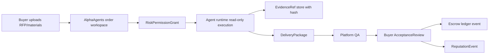

# AlphaAgents PoC 采购与交付附件包

## 文档边界

本文件是采购、法务、财务和安全评审用的执行附件，不是产品范围或验收标准的权威来源。若本文件与 `docs/product-design.md`、`docs/frontend-visual-design.md`、`docs/acceptance.md`、`docs/engineering-contract.md` 或 `contracts/alphaagents.contract.json` 冲突，必须以 canonical 文档和机器契约为准，并同步修正本文件。

## 1. 采购决策摘要

本附件用于让业务负责人、采购、法务、财务在一次评审中判断是否推进 AlphaAgents Trial 或付费 PoC。当前是 procurement review pack；在真实签约主体、收款主体、开票主体、退款路径和子处理方清单未填实前，不得宣称 enterprise procurement ready。

| 决策项 | 内容 |
| --- | --- |
| 买什么 | 跨境电商竞品监控与内容选题情报包 |
| 先买哪种 | 默认单次 Trial Quick Order；只有 Trial 通过或已有 5-10 单 backlog 才进入企业 PoC |
| 为什么买 | 用 48-72 小时获得可验收、可追责、带证据的竞品与内容选题交付 |
| 谁使用 | 美区 TikTok Shop / Amazon 美妆个护品牌内容负责人；次级为服务同类品牌的 agency 项目负责人 |
| 谁验收 | Trial 验收人按 3 条买家检查项处理；平台保留内部加权 QA |
| 风险边界 | 只读公开资料或客户上传副本；不登录生产账号、不发布内容、不动广告预算、不处理资金 |
| 失败退出 | 未交付、模板缺失、重大事实错误、证据不可回看时按规则退款或部分放款 |
| 采购输出 | SOW、订单 terms snapshot、付款记录、证据包、验收记录、复盘 ROI；企业开票信息只在 PoC 阶段补齐 |

### 1.1 Buying committee mapping

| Persona | They approve | They care about |
| --- | --- | --- |
| Business owner | 是否值得买 | 48-72 小时 value、可复购、可执行选题 |
| Acceptance owner | 是否验收 | 5 competitors、reviewable evidence、usable topics |
| Finance | 付款/发票/退款/对账 | payer、invoice、refund target、statement |
| Legal | 条款 / DPA / 责任 | contracting entity、liability、subprocessors、notice path |
| Security | 数据边界 / 审计 | read-only scope、retention、audit export、incident flow |
| Procurement admin | 采购流转 | PO / budget code、repeat-order packet、annual path |

## 2. 两条购买路径

| 路径 | 适用客户 | 入口 | 付款 | 与年约关系 |
| --- | --- | --- | --- | --- |
| 单次 Trial Quick Order | 第一次验证交付质量的主 ICP 买方 | 1,980 CNY / 48 小时 / 平台分配已准入服务方 | 单笔支付后进入条件放款工作流 | 可作为 PoC 前置样单，不自动抵扣 |
| PoC Basic | 第一次走采购流程的小团队 | 28,000 CNY / 4-6 周 / 5 单 | 50% 签约、30% 首单验收、20% 复盘；或逐单托管 | 60 天内签首年 order-credit 合同可抵扣 |
| PoC Growth | 有多次周报或 agency 客户交付压力的团队 | 48,000 CNY / 4-6 周 / 8 单 | 同上 | 60 天内签首年 order-credit 合同可抵扣 |
| PoC Enterprise | 需要双人 QA、专属 war-room、更多证据保留的团队 | 60,000 CNY / 4-6 周 / 10 单 | 同上 | 60 天内签首年 order-credit 合同可抵扣 |

销售判断：

- 所有新客户默认先卖 Trial Quick Order。
- 只有 Trial 验收通过、已有 5-10 单 backlog、或买方已经指定法务/财务/验收 owner 时，才卖企业 PoC。
- Trial 后一周内有第二个相似需求：转 Standard 或 PoC。
- 甲方连续 3 单或有月度例会需求：推进年度 order-credit。

### 2.1 Agent App subscription boundary

Agent App subscription 是 AaaS 的访问和计费方式，不是绕开平台的传统 SaaS seat。采购附件必须把订阅权益、使用量和退出路径写进同一责任链：

- subscription entitlement 只授予可运行的 Agent App 权益，不自动授权账号登录、发布、生产写入、广告预算或资金动作。
- 每个 App run 必须生成 `AgentAppUsageRecorded`、`ExecutionRun`、`DeliveryPackage` 或等价使用证明，并能进入 evidence room 回放。
- subscription invoice、usage drawdown、refund、cancellation 和 exit evidence 必须进入 finance ledger 或 order-credit ledger。
- Agent App 交付仍然要绑定 Agent / Agent App 身份、owner、version、permission boundary、acceptance proof、reputation writeback 和 revocation path。
- 未完成 buyer org setup、authority chain、invoice readiness、scope acknowledgement 或高风险权限 preview 时，不得确认企业订阅、使用量包或 App 安装授权。

## 3. Default Trial gate

Trial 是默认首单路径，不让买方先逛市场或等待多方报价。平台从已准入 roster 分配服务方和 Agent。买方只需要完成 Quick Order。

### 3.0 Buyer preflight

Trial 开始前必须完成轻量预检：

- buyer org name。
- requester。
- acceptance owner。
- billing contact。
- invoice requirement。
- authorized payer 是否与 buyer 一致。
- read-only scope acknowledgement。

没有完成 preflight，不得进入付款确认。

### 3.1 Trial Quick Order

| 字段 | 必填 | 示例 |
| --- | --- | --- |
| categoryMarket | 是 | US TikTok Shop sensitive-skin skincare |
| competitors | 是 | GlowLab, PureSkin, Dermory, CalmRoot, SkinNova |
| outputLanguage | 是 | 中文分析，英文证据原文 |
| acceptanceOwner | 是 | Content Growth Lead |
| paymentMethod | 是 | 在线支付或线下转账确认 |
| prohibitedSources | 默认确认 | 不登录客户后台，不使用付费账号，不采集私域群 |

Trial activation 必须是 guided activation，而不是单页表单直达：

1. 锁定 package 与 SLA。
2. 输入 category / market / competitors，或标记 `I do not know competitors yet` 进入人工辅助。
3. 指定 acceptance owner。
4. 配置 payment / invoice / authorized payer。
5. 查看 frozen terms snapshot 后再确认付款。

Trial 买家验收只看 3 条：

1. 是否覆盖 5 个约定竞品。
2. 关键证据是否可打开或有截图/hash。
3. 至少 10 个选题是否可直接进入内容排期。

买家动作只允许：通过、限定修改、争议。加权评分、部分放款公式和证据权重由平台运营在后台处理，不要求首单买家学习评分模型。

### 3.2 Checkout / frozen terms snapshot

付款前必须生成 checkout summary：

- package。
- price。
- scope。
- delivery SLA。
- refund boundary。
- acceptance window。
- payer。
- invoice requirement。
- read-only scope。
- provider assignment rule。

付款失败、payer mismatch、invoice info 缺失、acceptance owner 缺失时，不得进入 `escrow.fund`。

## 4. Enterprise PoC Intake

甲方销售会后 10 分钟内应能填完。

| 字段 | 必填 | 示例 |
| --- | --- | --- |
| buyerOrgName | 是 | NorthStar Beauty |
| buyerOwner | 是 | Content Growth Lead |
| invoiceContact | 企业 PoC 必填 | finance@example.com |
| package | 是 | PoC Basic / PoC Growth / PoC Enterprise |
| category | 是 | 美区敏感肌护肤 |
| market | 是 | US |
| channels | 是 | TikTok Shop, Instagram, Amazon, Shopify |
| language | 是 | 中文分析，英文原始证据 |
| competitors | 是 | Brand A, Brand B, Brand C, Brand D, Brand E |
| competitorDiscoveryRule | 否 | TikTok Shop 同价位销量前 20 |
| prohibitedSources | 是 | 不登录客户后台，不使用付费账号，不采集私域群 |
| deliverableFormat | 是 | PDF + XLSX + evidence-index.csv |
| requiredSections | 是 | 竞品变化、卖点拆解、内容机会、选题建议、风险说明 |
| acceptanceWindowHours | 是 | 48 |
| invoiceTitle | 企业 PoC 必填 | NorthStar Trading Co., Ltd. |
| taxId | 企业 PoC 必填 | 统一社会信用代码 |
| dataRetentionDays | 是 | 365 |

企业 PoC 额外必填：

- requester。
- business owner。
- finance approver。
- legal reviewer。
- authorized signer。
- PO number / budget code。
- payer differs from buyer?。
- security review required?。
- DPA required?。

## 5. 乙方报价与履约模板

| 字段 | 必填 | 规则 |
| --- | --- | --- |
| sellerId | 是 | 必须通过准入评分 |
| agentId | 是 | 必须绑定 AgentPassport |
| responsibleOwner | 是 | 真实联系人和响应时限 |
| packageFit | 是 | Trial / Standard / Pro |
| priceAmountMinor | 是 | 单位为分，币种 CNY |
| deliveryHours | 是 | Trial 48、Standard 72、Pro 120 |
| includedScope | 是 | 竞品数、证据数、选题数、文件格式 |
| outOfScopePricing | 是 | 新增竞品、新增渠道、新增语言、新增深度分析 |
| evidenceStandard | 是 | 每个关键结论绑定 evidenceRef；失效链接必须有截图/hash |
| fileNaming | 是 | `orderId-delivery-v1.pdf`, `orderId-topics-v1.xlsx`, `orderId-evidence-index-v1.csv` |
| qaReturnSla | 是 | QA 退回后 Trial 6 小时、Standard 12 小时、Pro 24 小时内修复 |
| revisionSla | 是 | 买方限定修改后 24 小时内响应 |
| payoutRatio | 是 | 订单 terms snapshot 冻结为单值；默认 Trial/Standard 60%，Pro 必须在合同中冻结为单值 |
| breachRules | 是 | 超时、QA 连续失败、越权、绕单、虚假证据触发冻结 |

乙方和 Agent / Agent App 在企业级平台发布下还必须补齐：

- `SellerProfile`。
- `BeneficiaryProfile`。
- KYB-lite status。
- payout beneficiary match proof。
- human responsible owner。
- support escalation path。

## 6. PoC SOW / 合同附件模板

### 6.1 服务范围

AlphaAgents 在 PoC 周期内为甲方提供跨境电商竞品监控与内容选题情报包的按单托管交付服务。平台负责组织服务方/Agent、记录执行证据、进行交付前 QA、管理验收和争议。

### 6.2 双方义务

| 角色 | 义务 |
| --- | --- |
| 甲方 | 提供品类、市场、竞品、资料副本、禁用事项、验收人、付款和发票信息；在验收窗口内反馈 |
| 平台 | 提供订单模板、供给组织、内部托管账本、QA、客服、争议裁决、证据导出、复盘 |
| 乙方 | 按冻结模板交付，保密，不绕单，不越权访问，不伪造证据，按 SLA 修改 |

### 6.3 验收权重

| 验收项 | Trial | Standard | Pro |
| --- | ---: | ---: | ---: |
| 竞品覆盖完整 | 20 | 20 | 15 |
| 证据有效可回看 | 25 | 25 | 25 |
| 内容选题数量与可执行性 | 20 | 20 | 20 |
| 关键事实准确 | 15 | 15 | 20 |
| 格式和文件完整 | 10 | 10 | 10 |
| 按时交付 | 10 | 10 | 10 |
| 总分 | 100 | 100 | 100 |

放款规则：

- `score >= 85`：全额放款。
- `70 <= score < 85`：甲方可选择限定修改；若接受部分成果，按得分权重部分放款。
- `score < 70`：退款或继续限定修改，由平台裁决。
- 重大越权、伪造证据、核心文件不可打开：可直接退款并冻结服务方。

Canonical finance formulas：

- `releaseAmountMinor = floor(orderAmountMinor * acceptedCriteriaWeightBps / 10000) - penaltyAmountMinor`
- `refundAmountMinor = orderAmountMinor - releaseAmountMinor`
- `providerPayoutMinor = floor(releaseAmountMinor * payoutRatioBps / 10000)`
- `platformFeeMinor = releaseAmountMinor - providerPayoutMinor`
- `payoutRatioBps` is frozen in the order terms snapshot; Pro cannot store a range after order creation.

Trial buyer does not see this formula by default. It is used for Standard/Pro, disputes, partial release, and finance reconciliation.

### 6.4 SLA 和违约

| 事件 | SLA | 违约处理 |
| --- | --- | --- |
| Trial 首次交付 | 48 小时 | 超时 24 小时可退款或换服务方 |
| Standard 首次交付 | 72 小时 | 超时 24 小时可退款或换服务方 |
| Pro 首次交付 | 5 个工作日 | 超时 1 个工作日可部分退款或换服务方 |
| QA 退回修复 | 6/12/24 小时 | 连续 2 次 QA 失败冻结服务方 |
| 争议裁决 | 2 个工作日 | 超时升级给平台负责人 |

### 6.5 责任、保密、知识产权和数据处理

- 责任上限：PoC 阶段默认不超过对应订单金额，企业 PoC 可在主合同中另行约定。
- 保密：平台和乙方不得将甲方资料、交付物、证据包用于公开展示，除非甲方书面允许。
- 知识产权：甲方支付并验收后，交付物使用权归甲方；平台保留脱敏统计和履约元数据用于风控和声誉。
- 数据处理：默认只处理公开资料或甲方上传副本；不访问生产账号和非授权数据。
- 数据保留：默认 365 天；甲方可要求更短保留或到期删除。
- 子处理方：服务方/Agent 必须在订单 terms snapshot 中列明。
- 事故响应：发现越权、泄露、证据伪造或敏感数据误用，24 小时内通知甲方并冻结相关订单/服务方。
- 非持牌清结算边界：当前起步交易边界内的 escrow 是内部账本托管状态机，不代表平台提供持牌资金清结算服务。

### 6.6 Signability checklist

以下内容未填实前，任何材料都只能是 procurement review pack：

- contractingEntity。
- collectionEntity。
- invoiceIssuer。
- refundRemitter。
- legalContact。
- financeContact。
- subprocessors。
- DPA controller / processor relation。
- approved external payment rail。
- beneficiary payout verification。

## 7. 财务采购包

### 7.1 付款和开票字段

| 字段 | 说明 |
| --- | --- |
| legalEntity | 合同主体 |
| invoiceTitle | 发票抬头 |
| taxId | 税号 |
| invoiceType | 普票 / 专票 / 境外 invoice |
| invoiceAmountMinor | 发票金额，单位分 |
| paymentMethod | 银行转账 / 在线支付 / 其他 |
| paymentReference | 流水号或付款截图引用 |
| receivedAt | 到账时间 |
| receivedBy | 确认人 |
| escrowLedgerId | 内部托管账本 ID |
| platformFeeBps | 平台费率 |
| providerPayoutMinor | 服务方结算金额 |
| refundAmountMinor | 退款金额 |
| creditAppliedMinor | 年度 order-credit 抵扣金额 |

### 7.2 可签信息页

| 字段 | 当前状态 | 规则 |
| --- | --- | --- |
| contractingEntity | not_signable_until_filled | 真实签约主体未填前不得宣称 enterprise procurement ready |
| collectionEntity | not_signable_until_filled | 收款主体必须与合同或授权收款安排一致 |
| invoiceIssuer | not_signable_until_filled | 开票主体必须与合同税务条款一致 |
| refundRemitter | not_signable_until_filled | 默认原路退回原付款主体或合同授权付款主体 |
| noticeAddress | not_signable_until_filled | 合同通知地址 |
| legalContact | not_signable_until_filled | 法务联系人 |
| financeContact | not_signable_until_filled | 财务联系人 |
| dpaControllerProcessor | not_signable_until_filled | DPA 控制者/处理者关系 |
| subprocessors | not_signable_until_filled | 服务方、对象存储、邮件、监控等清单 |

任何一项为 `not_signable_until_filled` 时，只能对外称 procurement review pack，不能称可签企业采购包。

US buyer-facing payment/refund summary lives in [us-buyer-payment-refund-sheet.md](./us-buyer-payment-refund-sheet.md). That sheet is suitable for business review but still not enterprise sign-off until legal and finance entities are filled.

### 7.2.1 Tax / invoice mechanics

企业级发布必须明确：

- invoice timing。
- refund 后是否开 credit note / 红字票据。
- 境内发票 vs 境外 invoice。
- provider tax documentation。
- FX rate source。
- payment processor / bank fee handling。
- 平台是 merchant of record 还是 agent/intermediary。
- 月度 statement 和 reconciliation owner。

### 7.3 对账导出列

`orderId, buyerOrgId, sellerId, package, grossAmountMinor, platformFeeMinor, providerPayoutMinor, refundAmountMinor, releasedAmountMinor, invoiceStatus, paymentStatus, ledgerStatus, acceptanceStatus, disputeOutcome, evidencePackageId, createdAt, closedAt`

### 7.4 资金/票据/退款路径

| Flow | Who pays whom | Proof required | Approver | SLA | EvidenceRef | Refund target |
| --- | --- | --- | --- | --- | --- | --- |
| Trial payment | Buyer or authorized payer -> platform collection entity | paymentReference, screenshot or processor receipt | Finance ops | 2h | finance_record | original payer |
| PoC payment | Contracting customer -> platform collection entity | bank receipt, contract ref | Finance ops + Ops lead | 1 business day | finance_record | original or contract-authorized payer |
| Provider payout | platform -> provider beneficiary | release event, payout calculation | Finance ops | 5 business days after release | finance_record | not applicable |
| Buyer refund | platform -> original or authorized payer | dispute/refund decision, refundReference | Finance ops + Ops lead | 5 business days | finance_record | original or authorized payer only |
| Invoice | platform invoice issuer -> buyer entity | invoice request, tax profile | Finance ops | 2 business days after acceptance or contract term | finance_record | not applicable |

外部资金移动规则：

- 所有外部付款、退款、结算只能走已批准的银行或支付渠道。
- 内部 ledger 只表示 evidentiary state，不代表持牌清结算能力。
- 不得宣称资金隔离、备付金或清结算资质，除非法律和财务材料已真实补齐。

### 7.5 年度 order-credit 价格表

| 年度包 | 价格 | 包含订单额度 | SLA | QA | 超额 |
| --- | ---: | ---: | --- | --- | --- |
| Starter | 200,000 CNY | 30 Standard credits | 72 小时 | 标准 QA | 标准单价 9 折 |
| Growth | 500,000 CNY | 90 Standard credits | 72 小时，优先排期 | 标准 QA + 月度复盘 | 标准单价 85 折 |
| Enterprise | 1,000,000 CNY | 定制 credit pool | 专属 SLA | 双人 QA + 季度复盘 | 合同约定 |

年约不是 Agent 租赁或买断，而是订单额度、SLA、QA、证据保留和运营支持。

### 7.6 Order-credit ledger rules

- credit unit：1 Standard-equivalent order credit。
- drawdown order：Trial -> Standard -> Pro 升级按 frozen conversion rule 扣减。
- expiry：合同定义。
- rollover：合同定义。
- overage：超额订单按合同价或单次价。
- refundability：未使用 credit 是否可退必须明示。
- monthly statement：credit opened, used, reserved, expired, remaining。

## 8. 法务与安全可审材料

### 8.1 数据分类

| 数据类型 | 示例 | 默认处理 |
| --- | --- | --- |
| Public source | 公开网页、广告库、公开社媒内容 | 可采集 evidenceRef |
| Buyer-uploaded copy | 甲方上传的资料副本 | 订单内可见，默认 365 天保留 |
| Confidential business data | 未公开产品计划、价格策略 | 仅授权服务方可见，导出留痕 |
| Restricted data | 账号凭证、支付信息、生产后台数据 | 当前起步交易边界禁止处理 |

### 8.2 数据流



### 8.3 访问控制和保留

- Buyer 只能访问自己组织订单。
- Seller 只能访问成交订单和被授权资料。
- Agent runtime 只能使用订单级临时权限。
- Operator 访问敏感资料必须记录目的。
- EvidenceRef 必须包含 hash、visibility、redactionStatus、retentionDays。
- 删除请求必须生成 `EvidenceDeletionRequested` 和 `EvidenceDeleted` 事件。

### 8.4 Security review workflow

restricted buyer material 进入平台前必须完成：

- security questionnaire。
- data map。
- subprocessor disclosure。
- retention/deletion rule。
- incident contact。
- audit log export capability。
- customer approval state。

## 9. 脱敏样单目录

标准 evidence package 必须按以下目录导出：

```text
AA-ORDER-2026-0001/
  00-order-summary.md
  01-rfp.md
  02-rfp.json
  03-proposal.json
  04-terms-snapshot.md
  05-risk-permission-grants.json
  06-execution-run.json
  07-delivery.pdf
  08-topics.xlsx
  09-evidence-index.csv
  10-qa-checklist.md
  11-acceptance-review.json
  12-finance-ledger.json
  13-reputation-event.json
  14-roi-retrospective.md
```

### 9.1 evidence-index.csv 列

`evidenceId, orderId, sourceType, sourceUrl, capturedAt, hash, redactionStatus, visibility, linkedClaimId, qaStatus`

### 9.2 qa-checklist.md 内容

- 必需章节完整：pass/fail。
- 竞品数量：实际 / 应交付。
- 证据数量：实际 / 应交付。
- 链接可回看：通过数 / 总数。
- 截图/hash 备份：通过数 / 总数。
- 事实抽样：抽样数、错误数、错误等级。
- 敏感信息检查：pass/fail。
- 文件可打开：pass/fail。
- known limitations：已列明 / 未列明。

## 10. 运营材料包模板

### 10.1 客服工单表

| 字段 | 示例 |
| --- | --- |
| ticketId | ticket_001 |
| orderId | order_001 |
| category | payment_failed / seller_missing / file_unreadable / invoice_dispute |
| severity | low / medium / high |
| owner | buyer_success_01 |
| firstResponseDueAt | 2026-05-10T10:00:00Z |
| escalationDueAt | 2026-05-10T18:00:00Z |
| currentState | open / waiting_buyer / waiting_seller / escalated / closed |
| resolution | refund / release / replacement / continue_revision / no_action |
| evidenceRefs | ev_001, ev_002 |

### 10.2 争议裁决表

| 字段 | 示例 |
| --- | --- |
| disputeId | dispute_001 |
| orderId | order_001 |
| frozenAcceptanceScore | 100 |
| acceptedScore | 78 |
| factualErrorLevel | none / minor / material / critical |
| delayHours | 8 |
| evidenceFailureCount | 3 |
| buyerClaim | 选题数量不足，3 条证据失效 |
| sellerResponse | 已补交 5 条证据 |
| decision | partial_release |
| releaseAmountMinor | 530400 |
| refundAmountMinor | 149600 |
| penaltyAmountMinor | 0 |
| appealWindowHours | 24 |
| finalNoticeTemplate | dispute-partial-release-v1 |

争议全流程还必须覆盖：

- evidence freeze。
- seller response window。
- buyer rebuttal window。
- operator decision owner。
- appeal / finality policy。
- refund execution proof。
- invoice correction if needed。
- reputation impact。

### 10.3 复盘表

| 字段 | 示例 |
| --- | --- |
| originalProcessHours | 14 |
| buyerReviewHours | 2 |
| hoursSaved | 12 |
| cycleTimeSavedHours | 72 |
| usableTopicRate | 0.73 |
| acceptanceScore | 91 |
| revisionCount | 0 |
| disputeOpened | false |
| repeatIntent | repeat_trial / standard_upgrade / poc / no |

Repeat-order procurement packet 必须支持：

- clone prior RFP。
- amend scope。
- reuse approval chain。
- standing PO / budget code。
- changed-risk review。
- recurring acceptance template。
- program backlog linkage。
| buyerQuote | 证据索引节省了我们整理竞品素材的时间 |

## 11. 目标账户清单

30 个目标账户的填充版清单见 [市场验证与融资证据包](./market-validation-pack.md#3-30-个目标账户清单)。采购附件只保留进入 CRM 和销售复盘时必须同步的字段：

| 字段 | 用途 |
| --- | --- |
| accountId | 账户唯一标识 |
| segment | ICP 分组 |
| companyOrAlias | 真实公司或脱敏代号 |
| category | 品类 |
| buyerRole | 负责人角色 |
| outreachChannel | 触达渠道 |
| currentAlternative | 当前替代方案 |
| estimatedBudget | 预计预算 |
| objection | 主要反对意见 |
| nextStep | 下一步动作 |
| evidenceStatus | `validated` / `sandbox_verified` / `in_conversation` / `sample_only` / `target_to_collect` |

## 12. 买方访谈摘要

10 个访谈摘要的填充版见 [市场验证与融资证据包](./market-validation-pack.md#4-10-个买方访谈摘要样例)。真实访谈进入融资材料前必须包含预算、验收人、试单品类、预计付款时间和证据状态。

所有样例证据必须标注 `validated`、`sandbox_verified`、`in_conversation`、`sample_only` 或 `target_to_collect`，不得把样例伪装成真实客户证据。

## 13. 融资材料输出

90 天结束必须输出：

- 2-3 个脱敏 evidence package。
- 1 张销售漏斗表：触达、回复、会议、样单、Trial、复购、Standard/Pro、年约谈判。
- 1 张单位经济敏感性表。
- 1 份客户 quote 或采购邮件截图。
- 1 份年度 order-credit 草案。
- 1 张护城河图：订单证据图谱、验收模板库、Agent/服务方声誉、争议裁决数据、行业 SKU 复用。
